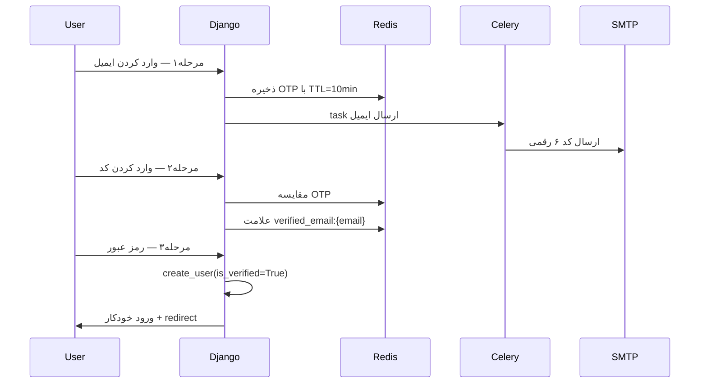

# طرح ثبت‌نام با تأیید ایمیل (Celery + Redis)

## وضعیت فعلی

| بخش | وضعیت |
|-----|--------|
| مدل `User` با `email` و `is_verified` | موجود در [`core/accounts/models.py`](core/accounts/models.py) |
| ورود/خروج | موجود در [`core/accounts/views.py`](core/accounts/views.py) |
| ثبت‌نام عمومی | **وجود ندارد** — فقط از پنل ادمین |
| Celery / Redis | **وجود ندارد** (نه در `requirements.txt`، نه در `docker-compose.yml`) |
| تنظیمات ایمیل | **کامنت‌شده** در [`core/core/settings.py`](core/core/settings.py) خطوط ۱۵۱–۱۶۱ |
| لینک ثبت‌نام در UI | placeholder استاتیک در [`core/templates/accounts/login.html`](core/templates/accounts/login.html) |

**نکته مهم:** سیگنال `create_profile` هنگام ساخت `User`، `Profile` را بدون `first_name` / `last_name` / `descriptions` می‌سازد — فیلدهای اجباری هستند و ثبت‌نام کاربر جدید احتمالاً خطا می‌دهد. این در فاز ۳ اصلاح می‌شود.

---

## جریان ثبت‌نام (۳ مرحله)



**پیش‌فرض‌ها** (چون سوال‌ها skip شد):
- فقط **ایمیل + رمز عبور** در ثبت‌نام (نام و پروفایل بعداً در داشبورد)
- کاربران با `is_verified=False` **اجازه ورود ندارند**

---

## فاز ۱ — زیرساخت Celery، Redis و ایمیل

**هدف:** آماده‌سازی سرویس‌ها قبل از نوشتن منطق ثبت‌نام.

### ۱.۱ وابستگی‌ها
افزودن به [`requirements.txt`](requirements.txt):
- `celery`
- `redis`
- `django-redis` (برای cache/OTP در Django)

### ۱.۲ Docker Compose
افزودن به [`docker-compose.yml`](docker-compose.yml):

- سرویس **`redis`** (پورت ۶۳۷۹)
- سرویس **`celery_worker`** (همان image بک‌اند، command: `celery -A core worker -l info`)
- `depends_on: [db, redis]` برای worker

### ۱.۳ تنظیمات Django
در [`core/core/settings.py`](core/core/settings.py):

```python
# Redis
CACHES = {
    "default": {
        "BACKEND": "django_redis.cache.RedisCache",
        "LOCATION": config("REDIS_URL", default="redis://redis:6379/1"),
    }
}

# Celery
CELERY_BROKER_URL = config("CELERY_BROKER_URL", default="redis://redis:6379/0")
CELERY_RESULT_BACKEND = config("CELERY_RESULT_BACKEND", default="redis://redis:6379/0")

# Email (فعال‌سازی تنظیمات کامنت‌شده موجود)
EMAIL_BACKEND = 'django.core.mail.backends.smtp.EmailBackend'
# ... بقیه از decouple
```

برای **توسعه محلی** بدون SMTP واقعی: سرویس `smtp4dev` اختیاری در docker-compose (پورت ۵۰۰۰ UI / ۲۵ SMTP) یا `EMAIL_BACKEND = console` موقتاً.

### ۱.۴ Celery app
ایجاد فایل‌های:
- [`core/core/celery.py`](core/core/celery.py) — ساخت `Celery('core')` و `autodiscover_tasks`
- ویرایش [`core/core/__init__.py`](core/core/__init__.py) — `from .celery import app as celery_app`

---

## فاز ۲ — مرحله ۱: درخواست کد تأیید

**URL:** `accounts/signup/`  
**View:** `SignupEmailView` (FormView)

### فرم
`SignupEmailForm` در [`core/accounts/forms.py`](core/accounts/forms.py):
- فیلد `email`
- اعتبارسنجی: ایمیل تکراری نباشد (`User.objects.filter(email=...).exists()`)
- rate limit: حداکثر ۳ درخواست در ۱۵ دقیقه per email (با Redis cache key `otp_rate:{email}`)

### سرویس OTP
فایل جدید [`core/accounts/services/otp.py`](core/accounts/services/otp.py):

```python
# generate_otp() → کد ۶ رقمی
# store_otp(email, code) → cache.set(f"otp:{email}", code, timeout=600)
# verify_otp(email, code) → مقایسه و delete
# mark_email_verified(email) → cache.set(f"verified:{email}", True, timeout=1800)
```

### Celery task
فایل [`core/accounts/tasks.py`](core/accounts/tasks.py):

```python
@shared_task
def send_verification_email(email, code):
    send_mail(subject="کد تأیید ثبت‌نام", message=f"کد شما: {code}", ...)
```

### تمپلیت
[`core/templates/accounts/signup_email.html`](core/templates/accounts/signup_email.html) — هم‌استایل با `login.html`

---

## فاز ۳ — مرحله ۲: تأیید کد OTP

**URL:** `accounts/signup/verify/`  
**View:** `SignupVerifyView`

- ایمیل از `session['signup_email']` (ذخیره‌شده در مرحله ۱)
- فرم `SignupVerifyForm` با فیلد `code`
- در صورت صحیح: `mark_email_verified(email)` + redirect به مرحله ۳
- خطا: پیام فارسی «کد نامعتبر یا منقضی شده»
- دکمه «ارسال مجدد کد» (با rate limit)

---

## فاز ۴ — مرحله ۳: تکمیل ثبت‌نام

**URL:** `accounts/signup/complete/`  
**View:** `SignupCompleteView`

### فرم
`SignupCompleteForm`:
- `password1`, `password2` (با `AUTH_PASSWORD_VALIDATORS` موجود Django)
- بررسی `is_email_verified(email)` از Redis قبل از ساخت کاربر

### ساخت کاربر
```python
user = User.objects.create_user(
    email=email,
    password=password,
    is_verified=True,
    type=UserType.CUSTOMER,
)
```

### اصلاح سیگنال Profile
در [`core/accounts/models.py`](core/accounts/models.py):

```python
Profile.objects.create(
    user=instance,
    first_name="",
    last_name="",
    descriptions="",
)
```

یا migration برای `blank=True, default=""` روی فیلدهای پروفایل (ترجیح: migration برای انعطاف بیشتر).

### پس از ثبت‌نام
- `auth.login(request, user)`
- پاک کردن session و کلیدهای Redis مربوطه
- پیام موفقیت + redirect به `/`

---

## فاز ۵ — امنیت ورود و UI

### مسدود کردن ورود کاربران تأییدنشده
در [`core/accounts/forms.py`](core/accounts/forms.py) — متد `confirm_login_allowed`:

```python
if not user.is_verified:
    raise ValidationError("لطفاً ابتدا ایمیل خود را تأیید کنید.", code='unverified')
```

### به‌روزرسانی URLها
[`core/accounts/urls.py`](core/accounts/urls.py):

```python
path('signup/', SignupEmailView.as_view(), name='signup'),
path('signup/verify/', SignupVerifyView.as_view(), name='signup_verify'),
path('signup/complete/', SignupCompleteView.as_view(), name='signup_complete'),
```

### به‌روزرسانی تمپلیت login
در [`core/templates/accounts/login.html`](core/templates/accounts/login.html):
- جایگزینی `./page-signup-simple.html` با ``

---

## ساختار فایل‌های جدید

```
core/accounts/
├── services/
│   └── otp.py          # منطق OTP + Redis
├── tasks.py            # Celery task ارسال ایمیل
├── forms.py            # + ۳ فرم جدید
├── views.py            # + ۳ view جدید
└── urls.py             # + ۳ URL جدید

core/templates/accounts/
├── signup_email.html
├── signup_verify.html
└── signup_complete.html

core/core/
├── celery.py           # جدید
└── __init__.py         # import celery app
```

---

## ترتیب اجرا (پیشنهادی)

هر فاز جدا تست می‌شود قبل از رفتن به فاز بعد:

1. **فاز ۱** — `docker compose up` + تست `celery -A core inspect ping` + تست `send_mail` از shell
2. **فاز ۲** — فرم ایمیل + ارسال OTP (بررسی Redis و صف Celery)
3. **فاز ۳** — تأیید کد
4. **فاز ۴** — ساخت کاربر + ورود خودکار
5. **فاز ۵** — سیاست ورود + لینک‌های UI

---

## متغیرهای محیطی جدید (.env)

```env
REDIS_URL=redis://redis:6379/1
CELERY_BROKER_URL=redis://redis:6379/0
CELERY_RESULT_BACKEND=redis://redis:6379/0
EMAIL_HOST=smtp4dev
EMAIL_PORT=25
DEFAULT_FROM_EMAIL=noreply@shop.local
```

---

## ریسک‌ها و نکات

- **SMTP در production:** باید credentials واقعی (Gmail App Password، SendGrid، ...) تنظیم شود
- **Celery worker:** بدون اجرای worker، ایمیل‌ها در صف می‌مانند — در docker-compose اضافه می‌شود
- **کاربران قدیمی ادمین:** `is_verified=False` هستند — یا migration data برای `is_verified=True` روی کاربران موجود، یا فقط روی کاربران جدید اعمال شود
- **resend OTP:** باید rate limit داشته باشد تا سوءاستفاده نشود
